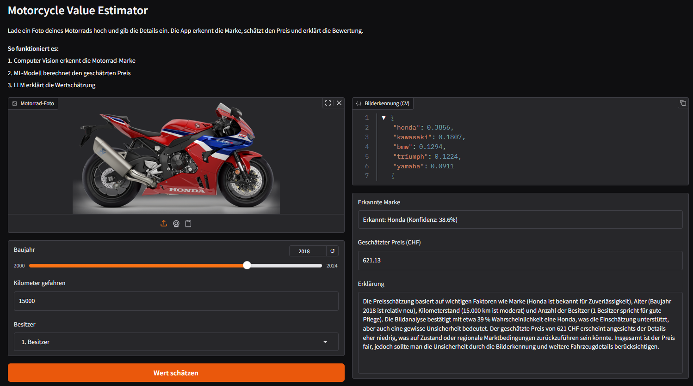
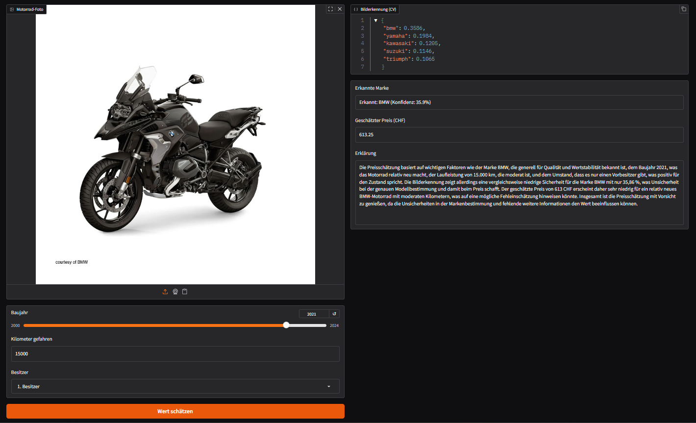

## Project Metadata

- Project title: Motorcycle Value Estimator
- Student: Alida Durovali
- GitHub repository URL: https://github.com/durovali/motorcycle-value-estimator
- Deployment URL: https://huggingface.co/spaces/durovali/motorcycle-value-estimator
- Submission date: 07 June 2026

### Mandatory Setup Checks

- [x] At least 2 blocks selected
- [x] Multiple and different data sources used
- [x] Deployment URL provided
- [x] Required GitHub users added to repository (`jasminh`, `bkuehnis`)

## Selected AI Blocks

- [x] ML Numeric Data
- [x] NLP
- [x] Computer Vision

Primary blocks used for core solution (choose 2):
- Primary block 1: Computer Vision (motorcycle brand recognition)
- Primary block 2: ML Numeric Data (price prediction)

If a third block is selected, it is documented and graded separately as extra work.
- Third block: NLP (LLM-based explanation of the price prediction)

---

## 1. Project Foundation (Short)

### 1.1 Problem Definition
- Problem statement: Estimating the value of a used motorcycle requires knowledge of the brand, age, mileage, and market conditions. Users often lack this expertise or access to reliable data.
- Goal: Build an integrated application that identifies the motorcycle brand from a photo, predicts its market value based on structured features, and generates a natural language explanation of the estimate.
- Success criteria: The app successfully classifies motorcycle brands from images, produces reasonable price estimates, and delivers clear German-language explanations that include uncertainty notes.

### 1.2 Integration Logic
- How the selected blocks interact: The three blocks form a sequential pipeline. Computer Vision identifies the brand from the uploaded image. The predicted brand is passed as a feature to the ML price model along with user-provided inputs (year, km, owner). The predicted price and all inputs are then sent to an LLM which generates a human-readable explanation.
- Data and output flow between blocks:

```
User uploads photo + enters year, km, owner
        |
[Computer Vision] ViT model classifies brand -> "BMW"
        |
[ML Numeric] Gradient Boosting uses brand + year + km + owner -> price (converted to CHF)
        |
[NLP] OpenAI GPT-4.1 explains the prediction in German
        |
User sees: CV scores, recognized brand, predicted price, explanation
```

---

## 2. Block Documentation

### 2A. ML Numeric Data (If selected)

#### 2A.1 Data Source(s)

| Entry | Source name or link | Type | Size | Role in this block |
| --- | --- | --- | --- | --- |
| 1 | [Kaggle: Motorcycle Dataset (nehalbirla)](https://www.kaggle.com/datasets/nehalbirla/motorcycle-dataset) | CSV (structured) | 1061 rows, 7 columns | Training data for price prediction model |

#### 2A.2 Preprocessing and Features
- Cleaning steps: Extracted brand name from the `name` column, handling multi-word brands like "Royal Enfield" and "Harley-Davidson". Dropped `ex_showroom_price` due to 41% missing values (435 of 1061 rows).
- Preprocessing steps: Encoded `owner` as numeric (1st=1, 2nd=2, etc.). Encoded `brand` as integer codes using a dictionary mapping. Calculated `age` as 2024 minus `year`.
- Feature engineering and selection: Final features used: `brand_code`, `year`, `km_driven`, `owner_num`, `age`. These capture the most important value drivers for used motorcycles.

> See *Preprocessing and Feature Engineering* in [`bike_details_training.ipynb`](bike_details_training.ipynb).

#### 2A.3 Model Selection
- Models tested: Random Forest Regressor, Gradient Boosting Regressor
- Why these models were chosen: Both are ensemble methods suited for structured tabular data. Random Forest provides a robust baseline, while Gradient Boosting often achieves better accuracy through sequential error correction. Both handle non-linear relationships and work with mixed feature types.

#### 2A.4 Model Comparison and Iterations

| Iteration | Objective | Key changes | Models used | Main metric | Change vs previous |
| --- | --- | --- | --- | --- | --- |
| 1 | Baseline | Default hyperparameters, 100 estimators | Random Forest | MAE: 19135, R2: 0.5511 | - |
| 2 | Improve accuracy | Same features, different algorithm | Gradient Boosting | MAE: 17764, R2: 0.6335 | MAE -7.2%, R2 +15% |

#### 2A.5 Evaluation and Error Analysis
- Metrics used: Mean Absolute Error (MAE), R-squared (R2)
- Final results: Gradient Boosting achieved MAE of 17764 INR and R2 of 0.6335 on the test set (20% holdout, 213 samples).
- Error patterns and likely causes: The model struggles with rare brands (e.g. BMW has only 1 sample, Harley-Davidson only 2). High-value motorcycles are underrepresented, leading to underestimation for premium brands. The dataset uses Indian market prices, which are converted to CHF in the app for the Swiss context.

#### 2A.6 Integration with Other Block(s)
- Inputs received from other block(s): The predicted brand label from the Computer Vision block is mapped to a brand code and used as input feature for price prediction.
- Outputs provided to other block(s): The predicted price (converted to CHF) is passed to the NLP block for explanation generation.

> See [`app.py`, lines 48-59](app.py#L48-L59) for the `predict_price` function.

---

### 2B. NLP (If selected)

#### 2B.1 Data Source(s)

| Entry | Source name or link | Type | Size | Role in this block |
| --- | --- | --- | --- | --- |
| 1 | OpenAI GPT-4.1-mini API | LLM API | N/A | Generates natural language explanations of price predictions |
| 2 | CV scores + ML prediction (runtime data) | Structured JSON | Per request | Context for explanation generation |

#### 2B.2 Preprocessing and Prompt Design
- Text preprocessing: No text preprocessing needed as the NLP block generates text rather than processing user text input.
- Prompt design or retrieval setup: A system prompt instructs the LLM to act as a motorcycle expert, explain the price estimate in German, mention key factors (brand, age, km, owner), include uncertainty notes, and respond in JSON format with an `answer` key. The user prompt includes all structured data: brand, year, km, owner count, CV confidence scores, and the predicted price in CHF.

> See [`app.py`, lines 62-99](app.py#L62-L99) for the `generate_explanation` function and prompt design.

#### 2B.3 Approach Selection
- Approach used: Prompt engineering with OpenAI GPT-4.1-mini via the Responses API.
- Alternatives considered: Classical template-based text generation was considered but rejected because it cannot adapt explanations to context (e.g. mentioning low CV confidence when relevant). A local transformer model was considered but would require significant compute resources on the deployment platform.

#### 2B.4 Comparison and Iterations

| Iteration | Objective | Key changes | Model or prompt setup | Main metric or qualitative check | Change vs previous |
| --- | --- | --- | --- | --- | --- |
| 1 | Basic explanation | Simple prompt asking for German explanation | GPT-4.1-mini, minimal prompt | Output was correct but sometimes included price recalculations | - |
| 2 | Structured output | Added strict JSON requirement, added instruction to not recalculate price | GPT-4.1-mini, structured prompt | Consistent JSON output, no price recalculation | More reliable output format |
| 3 | Context-aware | Added CV confidence scores to prompt, required uncertainty notes | GPT-4.1-mini, full context prompt | LLM mentions low confidence when relevant, always includes uncertainty | More informative explanations |

#### 2B.5 Evaluation and Error Analysis
- Evaluation strategy: Qualitative evaluation of generated explanations across different brands, years, and km values.
- Results: The LLM consistently produces relevant German explanations. It correctly references the input parameters and includes uncertainty notes about factors not captured by the model (condition, exact model, location).
- Error patterns and likely causes: Occasionally the LLM wraps JSON in Markdown code fences despite instructions. This is handled by the parse logic in the app which strips fences before parsing.

#### 2B.6 Integration with Other Block(s)
- Inputs received from other block(s): Receives the predicted brand (from CV), all user inputs (year, km, owner), CV confidence scores, and the predicted price (from ML).
- Outputs provided to other block(s): Provides the final user-facing German explanation text displayed in the app.

---

### 2C. Computer Vision (If selected)

#### 2C.1 Data Source(s)

| Entry | Source name or link | Type | Size | Role in this block |
| --- | --- | --- | --- | --- |
| 1 | Custom motorcycle image dataset (self-collected from web) | Images (JPG/PNG) | 55+ images, 6 classes | Training data for brand classification |
| 2 | [google/vit-base-patch16-224-in21k](https://huggingface.co/google/vit-base-patch16-224-in21k) | Pre-trained model | 85.8M params | Base model for transfer learning |

#### 2C.2 Preprocessing and Augmentation
- Image preprocessing: Images resized and center-cropped to 224x224 pixels. Normalized with ImageNet mean and standard deviation values. Converted to RGB format.
- Augmentation strategy: RandomResizedCrop (224px) and RandomHorizontalFlip applied during training to increase effective dataset size and improve generalization.

> See *Preprocessing and Augmentation* in [`motorcycle-dataset.ipynb`](motorcycle-dataset.ipynb).

#### 2C.3 Model Selection
- Vision model(s) used: Vision Transformer (ViT) base model, fine-tuned via transfer learning. The pre-trained checkpoint is `google/vit-base-patch16-224-in21k`.
- Why these model(s) were chosen: ViT achieves strong image classification performance and is well-supported by the HuggingFace transformers library. Transfer learning from ImageNet-21k allows effective training even with a small custom dataset.

#### 2C.4 Model Comparison and Iterations

| Iteration | Objective | Key changes | Model(s) used | Main metric | Change vs previous |
| --- | --- | --- | --- | --- | --- |
| 1 | Baseline fine-tuning | 10 epochs, lr=2e-5, batch=16, small dataset | ViT-base (fine-tuned) | Accuracy: 0.4545 | - |
| 2 | Compare with zero-shot | No training needed, uses text prompts | CLIP (vit-large-patch14) | 4/5 correct on test images | CLIP outperforms due to small dataset |
| 3 | Expand dataset | Added more images per brand | ViT-base (fine-tuned) | Improved confidence on test images | Higher and more consistent predictions |

The fine-tuned ViT initially underperformed because of the very small training set. Expanding the dataset with more images per brand improved the model's confidence and consistency on the deployed test images.

#### 2C.5 Evaluation and Error Analysis
- Metrics and/or visual checks: Accuracy on validation set. Qualitative testing with example images per brand on the deployed app.
- Final results: The model correctly classifies the main brands (BMW, Honda) on the deployed test images. Confidence values remain moderate (35-39% for the top class) due to the limited dataset size.
- Error patterns and limitations: Brands with similar styling (e.g. sport bikes from different manufacturers) can be confused. Further expanding the dataset to 50+ images per class would continue to improve accuracy and confidence.

#### 2C.6 Integration with Other Block(s)
- Inputs received from other block(s): Receives the user-uploaded motorcycle image directly.
- Outputs provided to other block(s): Provides the predicted brand label and confidence scores to the ML block (for price prediction) and to the NLP block (for context-aware explanation).

> See [`app.py`, lines 38-45](app.py#L38-L45) for the `classify_motorcycle` function.
> The trained model is hosted at [huggingface.co/durovali/vit-motorcycle](https://huggingface.co/durovali/vit-motorcycle).

---

## 3. Deployment

- Deployment URL: https://huggingface.co/spaces/durovali/motorcycle-value-estimator
- Main user flow:
  1. User uploads a motorcycle photo
  2. User sets year, kilometers, and owner count via sliders and dropdown
  3. User clicks "Wert schaetzen"
  4. App displays: CV classification scores, recognized brand, predicted price in CHF, and German explanation
- Screenshot or short demo:



Screenshot 1: Uploaded a BMW R 1250GS image. The CV model correctly classified it as BMW (35.9% confidence). The ML model predicted 613.25 CHF for a 2021 model with 15000 km and 1st owner. The LLM explanation noted BMW's reputation for quality and value stability, and flagged the moderate confidence in brand recognition.



Screenshot 2: Uploaded a Honda CBR image. The CV model correctly classified it as Honda (38.6% confidence). The ML model predicted 621.13 CHF for a 2018 model with 15000 km and 1st owner. The LLM explanation mentioned Honda's reliability, the moderate age and mileage, and included an uncertainty note about the brand recognition confidence.

---

## 4. Execution Instructions

- Environment setup:
  ```
  pip install gradio openai transformers torch numpy scikit-learn==1.6.1
  ```
- Data setup:
  - Download `BIKE DETAILS.csv` from [Kaggle](https://www.kaggle.com/datasets/nehalbirla/motorcycle-dataset)
  - Collect motorcycle images into `imagefolder/train/{brand}/` directory structure
  - Brands used: bmw, honda, kawasaki, suzuki, triumph, yamaha
- Training command(s):
  - ML model: Run [`bike_details_training.ipynb`](bike_details_training.ipynb) in Google Colab
  - CV model: Run [`motorcycle-dataset.ipynb`](motorcycle-dataset.ipynb) in Google Colab with T4 GPU
  - Outputs: `motorcycle_price_model.pkl`, `brand_codes.pkl`, and ViT model uploaded to HuggingFace
- Inference/run command(s):
  ```
  export OPENAI_API_KEY="your-key-here"
  python app.py
  ```
- Reproducibility notes:
  - scikit-learn version must be 1.6.1 (model was pickled with this version)
  - Python 3.11 recommended for deployment compatibility
  - Google Colab with T4 GPU used for CV training (~3 minutes)
  - ML training runs on CPU in under 1 minute
  - The `OPENAI_API_KEY` must be set as a secret in the Hugging Face Space settings

---

## 5. Optional Bonus Evidence

Use this section for exceptional work beyond the core requirements.

- [x] Third selected block implemented with strong quality
- [x] More than two data sources used with clear added value
- [ ] A core section is done exceptionally well
- [ ] Extended evaluation
- [ ] Ethics, bias, or fairness analysis
- [ ] Creative or exceptional use case

Evidence for selected bonus items:

**Third block (NLP):** The NLP block is fully integrated into the pipeline. It receives structured data from both the CV block (confidence scores) and the ML block (predicted price) and generates context-aware German explanations. The LLM adapts its output based on the CV confidence level. When confidence is low, it explicitly mentions the uncertainty in brand recognition. Three prompt iterations were performed to improve output quality.

**Multiple data sources:** Two distinct data sources are used:
1. Kaggle Motorcycle Dataset (structured CSV with 1061 entries) for ML price prediction
2. Custom-collected motorcycle images (6 brands) for CV brand classification

These are fundamentally different data types (tabular vs. image) serving different but connected roles in the pipeline.

**Future improvements:**
- Continue expanding the CV training dataset for even better classification accuracy
- Add more motorcycle brands to both the CV model and price dataset
- Include additional features like engine displacement (cc) and motorcycle type (sport, touring, cruiser) for better price predictions
- Use a Swiss or European motorcycle price dataset for more locally relevant estimates
